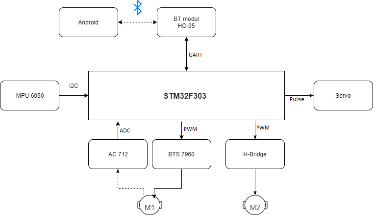
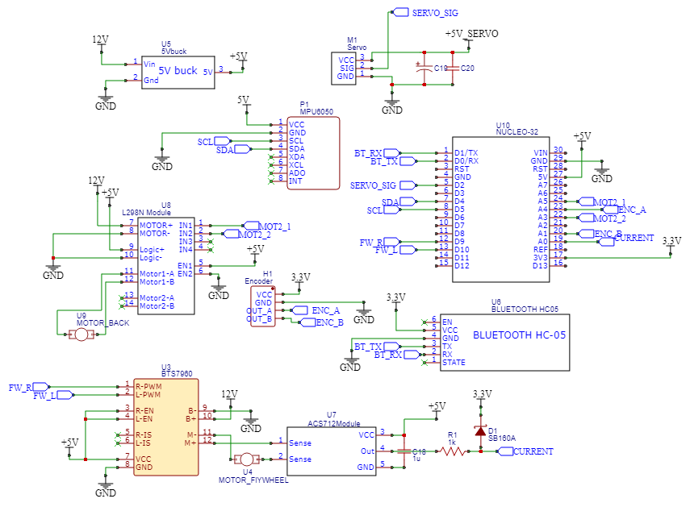

# Balancing motorbike
Cieľ nášho projektu je vytvoriť [motorku](https://www.youtube.com/watch?v=SUVtObDFFWY), ktorá sa dokáže sama udržiavať v stoji pomocou rotačného kynetického telesa. Telo robota vyrobíme pomocou 3D tlačiarne, podľa vlastného návrhu. Model budeme riadiť pomocou aplikácie z android telefónu, ktorý bude komunikovať s bluetooth modulom. Ten komunikuje cez UART s STM32, ktorý používame na riadenie všetkých komponentov. V našom modely máme motor na riadenie telesa pomocou ktorého riadime náklon, motor pre pohyb dopredu a dozadu, a servomotor pre natáčanie predného kolesa. V modely ďalej použivame MEMS snímač zrýchlenia a uhlovej rýchlosti, pre zistenie aktuálneho náklonu a ampérmeter spolu s H-most pre regulovanie motorov.
## Bloková schéma

## Elektricé zapojenie

## Komponenty
* H-most - BTS7960
* MEMS snímač - MPU6050
* Bluetooth modul - HC-05
* Vývojová doska - STM32F303K8
* H-most - L298N
* Snímač prúdu - ACS712
* Buck regulátory napätia
* Lineárny regulátor napätia - LM7805
* Pasívne komponenty - Odpory, kondenzátory
* Akumulátor
* Micro-servo motor
## Popis
Na riadiacej doske bežia 2 regulačné obvody s vysokou frekvenciou. Prvý RO zabezpečuje riadenie momentu motora, ktorý poháňa zotrvačník. Druhý RO udržiava rovnovážnu polohu celého zariadenia.
Spätná väzba od prúdu je zabezpečená senzorom ACS712. Výstup senzora je definovaná, ako Vout=Vcc/2 + k*I. Vcc je napájacie napätie, I je prúd, k je konštanta senzora. Výstup zaznamenávame A/D prevodníkom. Akčný zásah generujeme pomocou 25kHz PWM signálu.
Náklon zariadenia je meraný senzorom MPU6050, ktorý obsahuje 3-osový accelerometer a gyroskop, s 12 bitovými rozlíšeniami. So senzorom komunikujeme cez I2C zbernicu.
Motorka je riadená užívateľom z Android aplikácie cez bluetooth. Na komunikáciu využívame UART protokol.

# Zhrnutie
## Ovládanie
Motorku vieme ovládať vytvorenou aplikáciou z androidu. Z aplikácie vieme ovládať motorku dopredu, dozadu a natáčať predné koleso do strán. Všetky parametre pre regulátory vieme meniť taktiež z prostredia aplikácie.

## Návod na použitie
Po spárovaní telefónu s robotom musíme poslať štartovací signál po ktorom sa motorka začne inicializovať. V tom čase musí byť motorka v kľudnom stave. Následne po tejto inicializácií posielame druhý signál, ktorým spustíme balancovanie. Motorka sa musí nachádzať pred odoslaním druhého signálu vo vodorovnom stave.

## Dokumentácia
\
Naklonenie motorky čítame v hlavnej slučke programu cez I2C zbernicu s približnou frekvenciou 1 kHz. \
Príkazy pre ovládanie prijímame cez UART1 (bluetooth) a UART2 (USB). TIM1 generuje vysokofrekvenčný (22 kHz) PWM signál v Center aligned móde. Tento TIM1 spúšťa vzorkovane pomocou ADC. Na konniec konvertovania ADC zavolá DMA, ktorá kopíruje načítané hodnoty do pamäte.\
TIM6 volá funkciu prúdového regulátora s frekvenciou 10 kHz. \
TIM2 funguje v encoder móde, ktorý meria polohu zotrvačníka.\
TIM16 generuje PWM signál pre servo, ktorým otáčame predné koleso. Na update evente tohto časovača rátame rýchlosť zotrvačníka. \
TIM3 generuje PWM sinál pre zadný motor, ktorým poháňame motorku.

### Príkazy
* Q - rýchlosť
* W - servo
* M - prúdový regulátor Kp
* N - prúdový regulátor Ki
* B - prúdový regulátor želaná hodnota
* V - pozastaviť PR
* C - pokračovať PR
* X - resetovať PR integrátor
* L - balance regulátor Kp
* K - balance regulátor Ki
* J - balance regulátor Kd

# Zhodnotenie
Programová časť kódu spĺňa všetky body špecifikácie, ktoré sme si stanovili na začiatku práce. Pre nedostatočné skusenosti s vlasnosťami PETG materiálov sme neodhadli pevnosť a preto sa nám nepodarilo dosiahnuť rovnováhu motorky. Regulátor sa pokúša dostať motorku do rovnovážneho stavu vyvijaním veľkého momentu, ktorý nám zakaždým zničí naše vytlačené komponenty.
